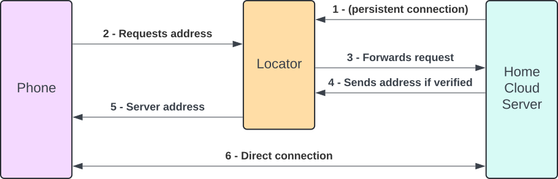

# Locator

The Home Cloud Locator service handles coordinating peer-to-peer connections between Home Cloud devices over the internet. This negotiation is necessary since Home Cloud devices are typically behind a firewall/NAT and so can not connect to each other directly without some sort of aided traversal.

## How it Works

Below is a diagram showing the process Home Cloud devices follow to "locate" each other using a Locator service:

The result of this discovery process is that both devices have each others public IP and ports on their respective NATs. Both devices then can attempt connections to each other on those addresses and negotiate a peer-to-peer WireGuard tunnel to each other.

The Locator is no longer needed once the tunnel is established until the connection is broken and then both devices can follow the same process above to relocate each other.

## Running a Locator

<!-- DOCKER COMPOSE AND CONFIG -->

